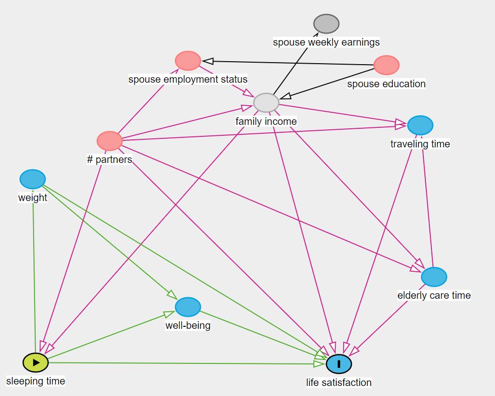
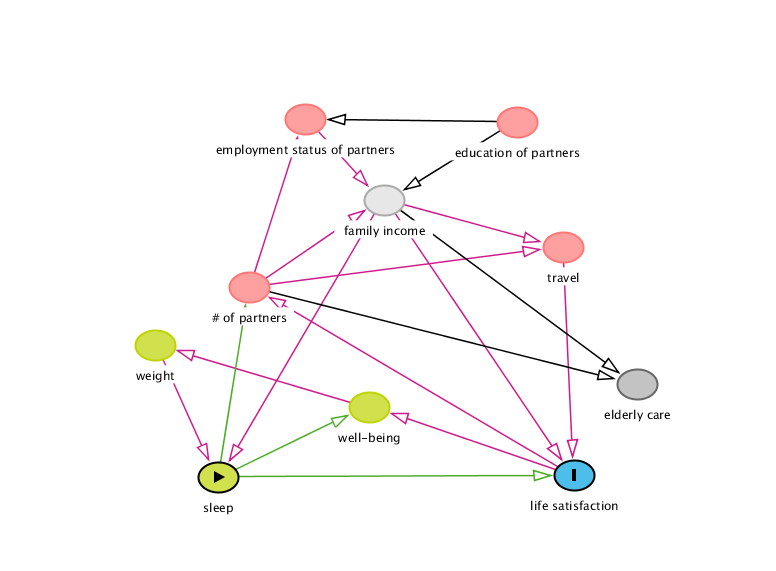

# Loading data

```{r,eval=TRUE, warning=FALSE, message=FALSE}
library(ipumsr)
ddi <- read_ipums_ddi("atus_00001.xml")
data <- read_ipums_micro(ddi)
library(dplyr) 
data <- select(data, WT06, SPOUSEPRES, SPEDUC, SPEMPSTAT, Sleeping_time, Traveling, FAMINCOME, WBLADDER, WBELIGTIME, caring_HH_adults, SPEARNWEEK)
data <- data %>%
  filter(!is.na(WBLADDER))%>%
  filter(WBLADDER > -1 & WBLADDER < 11)%>%
  filter(SPEDUC < 44)%>%
  filter(SPEMPSTAT < 7)
names(data)[1] <- "weight"
names(data)[2] <- "num_partner"
names(data)[3] <- "edu_partner"
names(data)[4] <- "employ_partner"
names(data)[5] <- "sleeping"
names(data)[6] <- "traveling"
names(data)[7] <- "income_fam"
names(data)[8] <- "life_satis"
names(data)[9] <- "well_being"
names(data)[10] <- "householdcare"
names(data)[11] <- "income_partner"
summary(data)
```

<br><br>

# Causal discovery 

```{r, message = FALSE}
library(pcalg)

suff_stat <- list(C = cor(data), n = nrow(data))
pc_data <- pc(suff_stat, indepTest = gaussCItest, labels = colnames(data), alpha = 0.01, skel.method = "stable.fast")

plot(pc_data, main = "")
```

```{r, echo=FALSE, message=FALSE, eval=FALSE}
library(dagitty)
dag <- dagitty("dag {
bb=\"0,0,1,1\"
\"# of partners\" [pos=\"0.321,0.503\"]
\"education of partners\" [pos=\"0.666,0.214\"]
\"household care\" [pos=\"0.821,0.673\"]
\"employment status of partners\" [pos=\"0.393,0.208\"]
\"family income\" [latent,pos=\"0.495,0.350\"]
\"life satisfaction\" [outcome,pos=\"0.740,0.832\"]
\"well-being\" [pos=\"0.476,0.713\"]
\"sleep\" [exposure,pos=\"0.281,0.835\"]
\"travel\" [pos=\"0.726,0.433\"]
\"weight\" [pos=\"0.200,0.604\"]
\"# of partners\" -> \"household care\"
\"# of partners\" -> \"employment status of partners\"
\"# of partners\" -> \"family income\"
\"# of partners\" -> \"travel\"
\"education of partners\" -> \"employment status of partners\"
\"education of partners\" -> \"family income\"
\"employment status of partners\" -> \"family income\"
\"family income\" -> \"household care\"
\"family income\" -> \"life satisfaction\"
\"family income\" -> \"sleep\"
\"family income\" -> \"travel\"
\"life satisfaction\" -> \"# of partners\"
\"life satisfaction\" -> \"well-being\"
\"well-being\" -> \"weight\"
\"sleep\" -> \"# of partners\"
\"sleep\" -> \"life satisfaction\"
\"sleep\" -> \"well-being\"
\"travel\" -> \"life satisfaction\"
\"weight\" -> \"sleep\"
}
")
plot(dag)
```

> The total effect cannot be estimated by covariate adjustment.

> The direct effect cannot be estimated by covariate adjustment.

<br><br>

# Subject knowledge causal graph

```{r}
# Convert variable type -- run AFTER using pcalg package
data$num_partner = as.factor(data$num_partner)
data$edu_partner = as.factor(data$edu_partner)
data$employ_partner = as.factor(data$employ_partner)
```

```{r}
summary(data)
```



> Adjustment, total effect: # partners, family income

> Adjustment, direct effect: # partners, family income, weight, well-being

```{r, echo=FALSE, message=FALSE, eval=FALSE}
library(dagitty)
dag <- dagitty("dag {
\"# partners\" [pos=\"-1.654,0.264\"]
\"elderly care time\" [pos=\"-0.216,1.101\"]
\"family income\" [latent,pos=\"-0.960,0.028\"]
\"life satisfaction\" [outcome,pos=\"-0.638,1.638\"]
\"sleeping time\" [exposure,pos=\"-1.983,1.629\"]
\"spouse education\" [pos=\"-0.427,-0.204\"]
\"spouse employment status\" [pos=\"-1.307,-0.231\"]
\"spouse weekly earnings\" [pos=\"-0.694,-0.458\"]
\"traveling time\" [pos=\"-0.277,0.167\"]
\"well-being\" [pos=\"-1.307,1.287\"]
weight [pos=\"-1.996,0.499\"]
\"# partners\" -> \"elderly care time\"
\"# partners\" -> \"family income\"
\"# partners\" -> \"life satisfaction\"
\"# partners\" -> \"sleeping time\"
\"# partners\" -> \"spouse employment status\"
\"# partners\" -> \"traveling time\"
\"elderly care time\" -> \"life satisfaction\"
\"elderly care time\" -> \"traveling time\"
\"family income\" -> \"elderly care time\"
\"family income\" -> \"life satisfaction\"
\"family income\" -> \"sleeping time\"
\"family income\" -> \"spouse weekly earnings\"
\"family income\" -> \"traveling time\"
\"sleeping time\" -> \"life satisfaction\"
\"sleeping time\" -> \"well-being\"
\"sleeping time\" -> weight
\"spouse education\" -> \"family income\"
\"spouse education\" -> \"spouse employment status\"
\"spouse employment status\" -> \"family income\"
\"traveling time\" -> \"life satisfaction\"
\"well-being\" -> \"life satisfaction\"
weight -> \"life satisfaction\"
weight -> \"well-being\"
}
")
plot(dag)
```

<br><br>

# Exploratory data analysis

```{r}
library(ggplot2)
ggplot(data=data,aes(x=sleeping,y=life_satis))+geom_point()+geom_smooth()
```

```{r}
ggplot(data=data,aes(x=sleeping,y=life_satis,color=factor(num_partner)))+geom_point()+geom_smooth()
```

```{r}
# Alternatively
ggplot(data, aes(x = sleeping, y = life_satis)) +
    geom_boxplot() +
    facet_grid(~num_partner) 
```

```{r}
library(splines)
ggplot(data, aes(y = num_partner, x = sleeping)) +
    geom_point() +
    geom_smooth(se = FALSE, color = "blue") +
    geom_smooth(formula = y~ns(x,2), method = "glm",
        method.args = list(family="binomial"),
        se = FALSE, color = "red"
    )

ggplot(data, aes(y = weight, x = sleeping)) +
    geom_point() +
    geom_smooth(se = FALSE, color = "blue") +
    geom_smooth(formula = y~ns(x,2), method = "glm",
        method.args = list(family="binomial"),
        se = FALSE, color = "red"
    )
```


```{r, message=FALSE}
mod1 <- lm(life_satis~sleeping, data = data)
summary(mod1)

mod2 <- lm(well_being~weight, data = data)
summary(mod2)
```

```{r}
mod3 <- lm(life_satis~householdcare, data = data)
summary(mod3)

mod4 <- lm(life_satis~weight, data = data)
summary(mod4)
```

```{r, message=FALSE}
mod5 <- lm(sleeping~weight, data = data)
summary(mod5)

mod6 <- lm(life_satis~num_partner, data = data)
summary(mod6)

mod7 <- lm(sleeping~num_partner, data = data)
summary(mod7)

mod8 <- lm(life_satis~well_being, data = data)
summary(mod8)

mod9 <- lm(sleeping~well_being, data = data)
summary(mod9)

mod10 <- lm(life_satis~traveling, data = data)
summary(mod10)
```

```{r}
mod11 <- lm(traveling~householdcare, data = data)
summary(mod11)
```

```{r}
mod12 <- glm(num_partner~householdcare, family = "binomial", data = data)
summary(mod12)

mod13 <- glm(num_partner~traveling, family = "binomial", data = data)
summary(mod13)

mod14 <- glm(num_partner~employ_partner, family = "binomial", data = data)
summary(mod14)

mod15 <- glm(edu_partner~employ_partner, , family = "binomial", data = data)
summary(mod15)
```

> All associations in the dagitty graph above are checked. Except insignificant associations between life satisfaction and weight, life satisfaction and elderly care, and traveling and elderly care, the rest are all strong associations.

```{r}
mod16 <- lm(life_satis~sleeping+well_being, data = data)
summary(mod16)

mod17 <- lm(weight~sleeping+well_being, data = data)
summary(mod17)
```

> From model 16, controlling for well-being makes sleep and life satisfaction a strong association. Therefore, well-being must be a collider. From model 17, controlling for well-being makes sleep and weight a weak association. Therefore, neither well-being nor weight can be a collider in this set and thus well-being must point to weight and weight must point to sleep.

```{r}
mod18 <- lm(life_satis~sleeping+num_partner, data = data)
summary(mod18)
```

> From model 18, controlling for number of partners makes sleep and life satisfaction a strong association. Therefore, number of partners must be a collider.



<br><br>

# IPW with sensitivity analysis for unmeasured confounder 

## IPW

> To achieve conditional exchangeability, condition on # partners and  family income

> Family income is unmeasured so use proxy = spouse weekly earnings

**Linearity?**

```{r}
ggplot(data, aes(x = income_partner, y = sleeping)) +
    geom_point() +
    geom_smooth(se = FALSE, color = "blue") +
    geom_smooth(formula = y~x,
        se = FALSE, color = "red"
    )
```

[source code](https://remlapmot.github.io/cibookex-r/ip-weighting-and-marginal-structural-models.html#program-12.4)

```{r}
ps_mod = lm(sleeping ~ num_partner + income_partner, data = data)

# estimation of denominator of ip weights
p <- predict(ps_mod, type = "response")
ps <-
  dnorm(data$sleeping,
        p,
        summary(ps_mod)$sigma)

# estimation of ip weights

data$ip_weight <- 1 / ps
summary(data$ip_weight)
```


```{r, message=FALSE}
library(survey) 

design <- svydesign(ids = ~0, weights = data$ip_weight, data = data)

msm_fit <- svyglm(
    life_satis ~ sleeping,
    data = data,
    design = design
)
summary(msm_fit)
```

```{r}
msm_fit <- svyglm(
    life_satis ~ sleeping*num_partner,
    data = data,
    design = design
)
summary(msm_fit)
```

```{r}
# Comparison
summary(lm(life_satis ~ sleeping + num_partner, data = data))
```

## Sensitivity analysis for unmeasured confounder

```{r, warning=FALSE, message=FALSE}
sensitivity_analysis_time <- function(.data, model_A, model_Y, assoc_A, assoc_Y) {
    n <- nrow(.data)

    # Obtain residuals with residuals()
    # Obtain residual variances with sigma()
    res_A <- residuals(model_A)
    res_var_A <- sigma(model_A)^2
    res_Y <- residuals(model_Y)
    res_var_Y <- sigma(model_Y)^2

    # Compute the mean and variance of U given A and Y
    mean_U_term1 <- (assoc_A/res_var_A)*res_A
    mean_U_term2 <- (((res_var_A - assoc_A^2)*assoc_Y)/(res_var_A*res_var_Y))*res_Y
    mean_U <- mean_U_term1 + mean_U_term2

    var_U_term1 <- (res_var_A - assoc_A^2)/(res_var_A*res_var_Y)
    var_U_term2 <- res_var_Y - assoc_Y^2 + ((assoc_A*assoc_Y)^2)/res_var_A
    var_U <- var_U_term1*var_U_term2

    # Simulate U and add it to the data
    U <- rnorm(n, mean = mean_U, sd = sqrt(var_U))
    .data$U <- U

    # Refit model to estimate the causal effect 
    updated_model <- lm(life_satis ~ sleeping + income_partner + num_partner + U, data = .data)
    
    list(c(
        estimate = unname(coefficients(updated_model)["sleeping"]), 
        ci_95_lower = confint(updated_model)["sleeping",1],
        ci_95_upper = confint(updated_model)["sleeping",2]
    ))
}

# Begin the sensitivity analysis

# Fit required models for the sensitivity analysis
mod_A <- lm(sleeping ~ income_partner + num_partner, data = data)
mod_Y <- lm(life_satis ~ sleeping + income_partner + num_partner, data = data)

# Set up degree of association between U and A and between U and Y
# The U->A associations have some constraints: we set up values 
# for the U->A associations that are at most equal to the
# standard deviation of the residuals from the model for A.
U_A_assocs <- seq(from = 0.5, to = 5, by = 0.5)
U_Y_assocs <- seq(from = 0.5, to = 1.5, by = 0.1)

# Form all combinations of the U->A and U->Y sensitivity parameters
sens_data <- expand.grid(U_A = U_A_assocs, U_Y = U_Y_assocs)

# Run sensitivity analysis
sens_data <- sens_data %>%
    group_by(U_A, U_Y) %>%
    mutate(sens = sensitivity_analysis_time(data, mod_A, mod_Y, U_A, U_Y))
# Collect sensitivity analysis results in a data.frame
sens_data <- bind_cols(sens_data[,1:2], bind_rows(sens_data$sens))


# Plot results
prepender <- function(string, prefix = "U -> Y strength:") paste(prefix, string)

ggplot(sens_data, aes(x = U_A, y = estimate)) +
    geom_ribbon(aes(ymin = ci_95_lower, ymax = ci_95_upper), fill = "grey70") +
    geom_line() +
    geom_hline(aes(yintercept = coefficients(mod_Y)["sleeping"]), color = "red", lty = "dashed") +
    geom_hline(aes(yintercept = 0), color = "black") +
    facet_wrap(~U_Y, labeller = as_labeller(prepender)) +
    labs(x = "Strength of U -> A association", y = "ACE and 95% CI")
```
